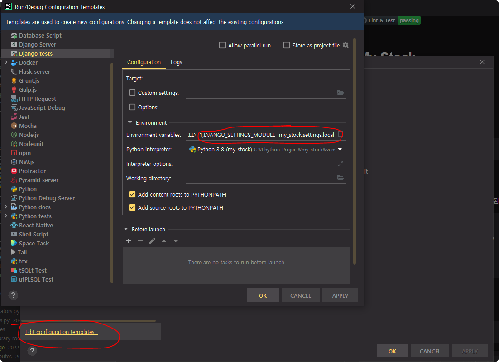

[](https://github.com/sanggi-wjg/my_stock/actions/workflows/django_ci.yml)

# My Stock

## Development Environment
```shell
Django 4.0
Python 3.10
MySQL  8.0

# Python Packages
requriements.txt
```

## Usage
만약 미국도 하고 싶다면 constants.py 에 추가 하면 됨
```shell
python manage.py migrate

http://localhost:8080/admin/stocks/market/ 접속
market 에 KOSPI, KOSDAQ 등록

python manage.py register_stocks KOSPI
python manage.py register_stocks KOSDAQ
```

### PyCharm Django setting 
환경 변수
```shell
DJANGO_SETTINGS_MODULE=my_stock.settings.local
```
